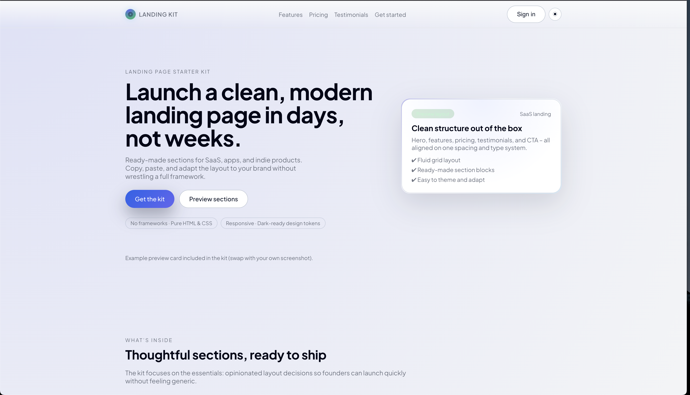
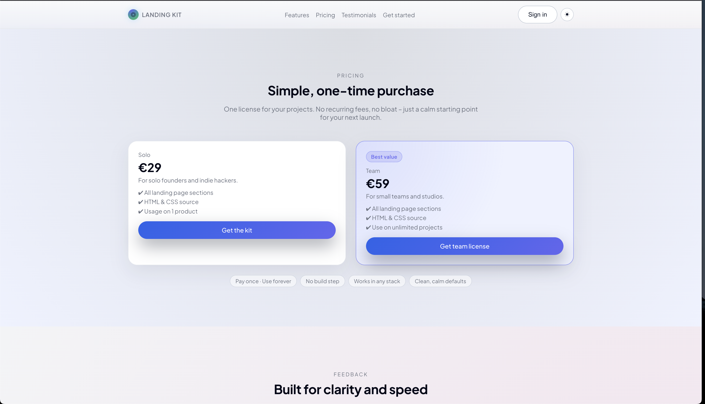

# Polyglot Landing Kit (v1)
**Landing Page Starter Kit · Polyglot Creative Web Studio**





A calm, modern, **mobile-first** landing page starter kit you can drop into any stack.  
Built with **pure HTML + CSS + minimal JS** (no build step, no frameworks).

---

## ✅ What this is
This kit is a production-ready landing page template for:
- SaaS products
- Apps
- Indie tools
- Personal / studio offers

Designed to help you **ship fast** with a clean layout, good typography, and consistent spacing.

---

## 🔥 What’s included
- `index.html` — complete landing page with:
  - Sticky header + mobile dropdown nav
  - Hero
  - Features grid
  - Pricing (with “best value” highlight)
  - Testimonials
  - Final CTA
  - Footer
- `style.css` — design tokens + responsive layout + animations
- `main.js` — theme toggle, mobile nav, smooth scroll, reveal-on-scroll
- Dark mode support (auto-detect + manual toggle)

---

## 🚀 Quick start (local)
Run it with any static server.

### Option A: VS Code Live Server
1. Open the folder in VS Code  
2. Right click `index.html` → **Open with Live Server**

### Option B: Python
```bash
python3 -m http.server 5500
```

Then open:

```
http://localhost:5500/
```

### Option C: Node (http-server)
```bash
npx http-server -p 5500
```

---

## 🧩 How to customize (fast)

### 1) Change branding (logo + title)
In `index.html`, update:
- `<title>...</title>`
- `.logo-text`
- CTA button text

### 2) Update colors + tokens (recommended)
Edit CSS variables in `style.css`:

```css
:root {
  --color-bg: #f3f4f6;
  --color-card: #ffffff;
  --color-accent: #2563eb;
  --color-text: #020617;
  --color-text-muted: #6b7280;
  --max-width: 1120px;
}
```

Dark theme overrides live here:

```css
body[data-theme="dark"] {
  --color-bg: #020617;
  --color-card: #020617;
  --color-accent: #6366f1;
  --color-text: #e5e7eb;
  --color-text-muted: #9ca3af;
}
```

### 3) Replace content sections
Open `index.html` and replace the text inside:
- `#features`
- `#pricing`
- `#testimonials`
- `#cta`

You can also delete sections you don’t need — each section is modular.

### 4) Replace the “preview card” with your screenshot
In the Hero section, replace the hero card content or swap it for an image.

Example:

```html

```

---

## 📱 Responsive behavior
- Desktop hero uses a 2-column grid, then collapses cleanly on smaller screens.
- Main breakpoints:
  - `@media (max-width: 900px)` → stacks hero, turns nav into dropdown, grids become 1 column
  - `@media (max-width: 480px)` → buttons full-width, tighter spacing

---

## 🌗 Theme behavior
- Auto-detects system theme on first visit
- Saves preference in `localStorage`
- Toggle button updates icon (☾ / ☀︎)

---

## 🌍 Deploy anywhere
This is static — deploy to any of these:

### Vercel
- Import repo → deploy (no build command)

### Netlify
- Drag & drop the folder, or connect repo

### GitHub Pages
- Repo Settings → Pages → deploy from main branch

---

## 📄 License & usage (v1 suggestion)

This kit is sold as a **one-time purchase** product.

### Solo license (suggested)
- Use on 1 product / website
- Commercial use allowed
- No redistribution / reselling as-is

### Team / Studio license (suggested)
- Use on unlimited client projects
- Commercial use allowed
- No redistribution / reselling as-is